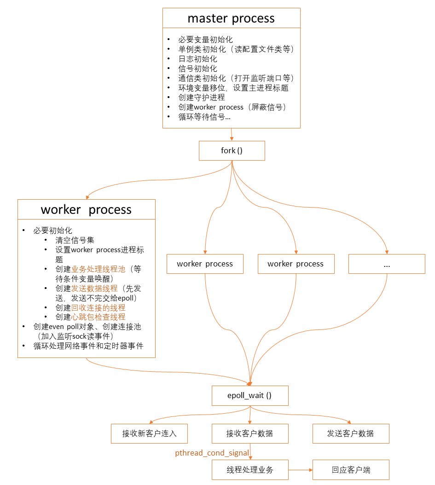

### 基于Nginx的通讯框架+业务逻辑框架

#### 项目包括：

+ 相对完整的多线程高并发服务器程序；
+ 按照包头+包体格式收发，完美解决了数据粘包问题；
+ 根据收到的数据包来执行不同的业务逻辑；
+ 把业务处理产生的结果数据包正确地返回给客户端。

#### 主要开发技术：

+ epoll高并发通讯技术（LT）；
+ 通过线程池技术处理业务逻辑；
+ 多线程，线程之间的同步技术包括互斥量、条件变量和信号量等；
+ 次要技术：信号，日志打印，fork()创建子进程，守护进程，心跳包等。

#### 借鉴官方Nginx精华代码：

+ 一个master进程，多个worker进程的进程框架；
+ epoll实现代码，但官方epoll的触发模式用的是ET（本项目LT）；
+ 借鉴了官方nginx的接收数据包以及发送数据包的核心代码。

#### 本项目独立实现代码：

+ epoll LT模式；
+ 写了一套线程池来处理业务逻辑，调用适当的业务逻辑处理函数，把处理完毕把数据发送回客户端；
+ 连接池中的连接的延迟回收；
+ 专门处理数据发送的一整套数据发送逻辑以及发送线程。

#### 安全问题考虑：

- 控制并发连入数量
  - 控制连入用户数量的解决思路：如果同时连入的用户数量超过了允许的最大连入数量时，我们就把这个连入的用户直接踢出去。
- flood攻击防范
  - 假设一个合理的客户端一秒钟发送数据包给服务器不超过10个，超过则踢出。
- 畸形数据包防范 
  - 对客户端数据细致判断；
  - 对收到的数据增加边界检查（如字符串数组末尾加＇\0＇）。
- 连接积压太多数据发送不出去
  - 一个连接发送数据包超过一定数量，提出该连接
- 因为延迟回收问题
  - 恶意用户不断连接，连接后退出，会导致空闲连接少，回收队列的连接非常多，总的连接很多
  - 等待回收队列出来后，再接收
- （补充中．．．）

